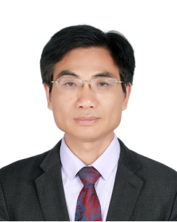

# 关于我
## 个人介绍
| 照片 | 简要介绍 |
|----------|--------------------------|
||**_肖亮_**，南京理工大学，紫金卓越教授，博士生导师，工学博士。入选国家万人计划科技创新领军人才、江苏省333工程领军科技人才（第二层次）、江苏省青蓝工程学术带头人，江苏省六大人才高峰计划。现任计算机学院副院长、教育部高维信息智能感知与系统重点实验室副主任、江苏省光谱信息感知与系统重点实验室副主任，CCF理事和杰出会员，中国计算机学会计算机视觉专委委员，江苏省计算机学会常务理事和学术工委主任。通过承担国家重点研发课题、科技部重大仪器专项、国家自然基金、江苏省前沿技术等国家级和省部级任务20余项，研制低空遥感大模型、多模态遥感智能解译系统、工业场景数字孪生和虚拟交互系统等，取得行业应用，获省部级科学技术奖7项。近五年，IEEE 汇刊、CVPR、ICCV等发表论文100余篇。拥有发明专利40余项；出版《现代图像处理学导论》《多源空谱遥感融合表示学习》等专著或教材5本，《图像分析基础》、《数据科学与工程》等3门课程获得省部级优秀课程，中国图象图形学会高等学校教育教学成果二等奖1项。|

# About Me
| Photo | Introduction |
|----------|--------------------------|
||**_Liang Xiao_** is a Zijin Distinguished Professor and Ph.D. supervisor at Nanjing University of Science and Technology. He has been recognized as a Leading Talent in Technological Innovation under the National Ten Thousand Talents Program and holds multiple provincial talent titles. He currently serves as Vice Dean of the School of Computer Science and Deputy Director of two key laboratories under the Ministry of Education and Jiangsu Province. His research focuses on remote sensing, computer vision, and intelligent perception systems. He has led over 20 national and provincial projects, published more than 100 papers in top journals and conferences such as IEEE Transactions, CVPR, and ICCV, and holds over 40 invention patents. He has received 7 provincial and ministerial-level Science and Technology Awards and authored several influential textbooks in image processing and remote sensing.|

 <table>
  <tr >
    <td>姓 名</td><td  width="390px">肖亮</td>
    <td>性 别</td><td  width="400px">男</td>
  </tr>
  <tr>
    <td>出生年月</td><td>1976年2月</td>
    <td>籍贯</td><td>湖南长沙</td>
  </tr>
  <tr>
    <td>民 族</td><td>汉族</td>
    <td>政治面貌</td><td>中国共产党党员</td>
  </tr>
  <tr>
    <td>最高学历</td><td>研究生毕业</td>
    <td>最后学位</td><td>工学博士</td>
  </tr>
  <tr>
    <td>技术职称</td><td>教授</td>
    <td>导师类别</td><td>博士生导师</td>
  </tr>
  <tr>
    <td>导师类型</td><td>校内</td>
    <td>兼职导师</td><td>否</td>
  </tr>
  <tr>
    <td>行政职务</td><td>副院长</td>
    <td>Email</td><td>xiaoliang@mail.njust.edu.cn</td>
  </tr>
  <tr>
    <td>工作单位</td><td>南京理工大学计算机科学与工程学院</td>
    <td>邮政编码</td><td>210094</td>
  </tr>
  <tr>
    <td>通讯地址</td><td>南京市孝陵卫200号</td>
    <td>个人主页</td><td><a href="https://www.researchgate.net/profile/Liang-Xiao-14">https://www.researchgate.net/profile/Liang-Xiao-14</a></td>
  </tr>
  <tr>
    <td>单位电话</td><td>025-84315645</td>
    <td>信息更新时间</td><td>2024年11月22日</td>
  </tr>
</table> 

## 指导学科
<table border="1" cellspacing="0" cellpadding="6" style="border-collapse:collapse; width:100%;">
  <tr>
    <td style="width:80px;">学科专业(主)</td>
    <td style="width:250px;">081203计算机应用技术</td>
    <td style="width:80px;">招生类别</td>
    <td style="width:100px;">博、硕士</td>
    <td style="width:80px;">所在学院</td>
    <td>计算机科学与工程学院</td>
  </tr>
  <tr>
    <td>研究方向</td>
    <td colspan="5">
      人工智能应用基础、机器学习与智能信息处理等研究；计算机视觉与图像理解；光谱成像与智能解译系统应用；
      多模态遥感AI基础模型与垂直类行业应用模型；虚拟现实与智能图形等 
      前期合作研发开源医学影像系统
      <a href="http://www.farsight-toolkit.org/wiki/Roysam_Laboratory" target="_blank">
        http://www.farsight-toolkit.org/wiki/Roysam_Laboratory
      </a> 等
    </td>
  </tr>
  <tr>
    <td>学科专业(辅)</td>
    <td>0835软件工程</td>
    <td>招生类别</td>
    <td>博、硕士</td>
    <td>所在学院</td>
    <td>计算机科学与工程学院</td>
  </tr>
  <tr>
    <td>研究方向</td>
    <td colspan="5">
      智能软件测试、AI系统可靠性和深度学习可解释性分析、领域软件服务计算与系统、真域感图形渲染与软件
    </td>
  </tr>
</table>

## 工作经历
- 2013.4-至今, 南京理工大学, 计算机科学与工程学院, 教授
- 2007.4-2013.3, 南京理工大学, 计算机科学与工程学院, 副教授
- 2004.3-2007.4, 南京理工大学, 计算机科学与工程学院, 讲师
- 2009.6-2010.7, 美国伦斯勒理工学院, 博士后, 合作导师: Badrineath Roysam
- 2006.1-2008.12, 南京理工大学控制科学与工程博士后流动站, 博士后, 合作导
师: 韦志辉

## 教育经历
- 1999.9–2004.3, 南京理工大学, 计算机应用技术, 博士, 导师: 吴慧中
- 1995.9–1999.7, 南京理工大学, 计算数学与应用软件, 学士,导师: 韦志辉

## 获奖、荣誉称号
- 国家级科技领军人才计划，2023；
- “岩心多参数数字化扫描装备研发与产业化应用”,自然资源科学技术奖，二等奖，2023，排名5.
- “高分辨率光谱智能感知与解译系统关键技术与应用”，江苏省科学技术奖，二等奖，2022，排名1；
- "公共安全视域下社会治理的赋能技术研究"， 中国指挥与控制学会科学技术奖，一等奖，2022，排名4.
- 江苏省333工程领军科技人才（第二层次），2022
- 江苏省青蓝工程中青年学术带头人，2020
- “小型机载成像光谱仪关键技术与应用”，国土资源科学技术奖，二等奖，2020，排名2；
- “基于空谱联合结构化特征的高光谱图像分析方法与应用技术”，江苏省科学技术奖，二等奖，2019，排名3；
- “红外矿物光谱数据综合处理系统”，国土资源科学技术二等奖，2018，排名4；
- “遥感地质应用微型高光谱成像仪与数据分析系统”，第二届军民两用技术创新应用大赛，铜奖，2017，排名1；
- “高性能图像与视频超分辨支撑理论与应用技术”，江苏省科学技术奖，三等奖, 2013, 排名1.
- 江苏省六大人才高峰，2012；
- 江苏省333工程中青年学术带头人，2011；
- 江苏省青蓝工程青年骨干教师，2008。
## 社会、学会及学术兼职
- 2011年担任江苏省光谱成像与智能感知重点实验室副主任;
- 2015年担任教育部高维信息智能感知与系统重点实验室副主任；
- CCF 理事和CCF 杰出会员
- 江苏省工业与应用数学学会理事
- 江苏省人工智能学会智能遥感专委会副主任
- 江苏省计算机学会学术工委执行主任
- CCF 秀湖会议AC委员，CCF 青年工委执委，CCF 计算机视觉专委委员，CCF 计算机应用专委委员
- IEEE Senior Member、ACM等会员
- CCF YOCSEF南京 2018-2019 主席，CCF 南京会员中心副主席【2018-2022】
- IEEE TPAMI、IEEE TIP、 IEEE TGRS、IEEE TNNLS、IEEE JSTARS、IEEE TSP、IEEE GRSL 等长期审稿人，若干国际期刊客座编辑
- 科技部项目、国家自然科学基金、人才项目评审、会评等专家
## 科研项目
- 江苏省地质局科研项目，航空多源遥感数据融合与智能化信息提取及应用研究，2023KY11，2023.9-2025.12
- 某部委项目. XXX数据驱动建模, 50万，子任务负责人
- 某部委项目. XXX交互式三维场景与基础服务系统，2588万，参与
- 国家自然科学基金【面上】，正则化模型与深度生成先验联合驱动的高光谱压缩快照重建方法，62471235，2025.1-2028.12，51万，主持
- 基于多模态预训练模型的发型生成方法研究，企业委托，20万，主持
- 基于双相机的高光谱低秩张量融合计算成像方法，专利成果转让，主持
- 江苏省前沿技术研发计划，低空多模态遥感基础模型与智能解译技术研发， BF2024070，2024.9-2027.8，1000万，主持
- 华为合作项目，移动端流体仿真平台项目，2024.9-2027.6，98.8万，主持
## 近期代表性项目
- 国家自然科学基金【面上】. 基于张量低秩和深度先验的高光谱与多光谱图像融合理论与方法，61871226，2019.1-2022.12，66万，主持
- 国家重点研发课题, 大视场机载高光谱成像数据处理与智能分析软件研发，2016YF01360， 2016.6-2020.12， 380万，主持
- 国家自然科学基金【面上】.高光谱图像联合超分辨与分类的结构化稀疏学习理论与算法，61571230，2016.1-2019.12，58万，主持
- 江苏省重点研发计划，面向公共安全的融合计算光谱视频成像技术与系统，2018.7-2022.12，60万，主持
- 国家自然科学基金重点项目，图像融合识别与 导向过程的数学理论与方法，2015.1-2020.12，280万，参与
- 国家重大科学仪器设备开发专项，岩心光谱扫描仪与产业化，2012.6-2018.12，3500万，子任务负责人
- 华为：智慧运营软件研发， 114万，主持
- 中央高校基本业务项目-重大重点项目培育专项，  融合计算光谱视频成像仪研发 30918011104， 30万
- 国家自然科学基金【面上】，结合时空统计学习的视频超分辨自适应稀疏正则化理论与算法，61171165，2012-01-01至2015-12-31 , 60万，主持
- 国家自然科学基金， 基于形态分量分析的图像超分辨重建机理与算法研究，60802039， 2009-01-01至2011-12-31 , 20万，主持
## 发表论文
- Ling Hu, Qichao Liu, Jia Liu, Liang Xiao:PRBCD-Net: Predict-Refining-Involved Bidirectional Contrastive Difference Network for Unsupervised Change Detection. IEEE Trans. Geosci. Remote. Sens. 61: 1-17 (2023)
- Wenzhen Wang, Fang Liu, Jia Liu, Liang Xiao:Cross-Domain Few-Shot Hyperspectral Image Classification With Class-Wise Attention. IEEE Trans. Geosci. Remote. Sens. 61: 1-18 (2023)
- Wenzhen Wang, Fang Liu, Wenzhi Liao, Liang Xiao:Cross-Modal Graph Knowledge Representation and Distillation Learning for Land Cover Classification. IEEE Trans. Geosci. Remote. Sens. 61: 1-18 (2023)
- Huicong Wu, Liang Xiao, Le Sun, Byeungwoo Jeon:A Novel Video Stabilization Model With Motion Morphological Component Priors. IEEE Trans. Multim. 25: 389-404 (2023)
- Jia Liu, Maoguo Gong, Liang Xiao，et.al:Evolving Connections in Group of Neurons for Robust Learning. IEEE Trans. Cybern. 52(5): 3069-3082 (2022)
- Ling Hu, Jia Liu, Liang Xiao.A Total Variation Regularized Bipartite Network for Unsupervised Change Detection. IEEE Trans. Geosci. Remote. Sens. 60: 1-18 (2022)
- Nan Huang, Liang Xiao, Jianjun Liu, Jocelyn Chanussot:Graph Convolutional Sparse Subspace Coclustering With Nonnegative Orthogonal Factorization for Large Hyperspectral Images. IEEE Trans. Geosci. Remote. Sens. 60: 1-16 (2022)
- Nan Huang, Liang Xiao, Yang Xu, Jocelyn Chanussot:A Bipartite Graph Partition-Based Coclustering Approach With Graph Nonnegative Matrix Factorization for Large Hyperspectral Images. IEEE Trans. Geosci. Remote. Sens. 60: 1-18 (2022)
- Qichao Liu, Liang Xiao, Jingxiang Yang, Zhihui Wei:Multilevel Superpixel Structured Graph U-Nets for Hyperspectral Image Classification. IEEE Trans. Geosci. Remote. Sens. 60: 1-15 (2022
- Hao Chen, Yangzhun Zhou, Jun Li, Xiu-Shen Wei, Liang Xiao:Self-Supervised Multi-Category Counting Networks for Automatic Check-Out. IEEE Trans. Image Process. 31: 3004-3016 (2022)
- Huicong Wu, Liang Xiao, Zhihui Wei:Simultaneous Video Stabilization and Rolling Shutter Removal. IEEE Trans. Image Process. 30: 4637-4652 (2021)
- Jie Song, Liang Xiao, Mohsen Molaei, Zhichao Lian:Sparse Coding Driven Deep Decision Tree Ensembles for Nucleus Segmentation in Digital Pathology Images. IEEE Trans. Image Process. 30: 8088-8101 (2021)
- Jianjun Liu, Zebin Wu, Liang Xiao, Jun Sun, Hong Yan:A Truncated Matrix Decomposition for Hyperspectral Image Super-Resolution. IEEE Trans. Image Process. 29: 8028-8042 (2020)
## 出版专著和教材
- 肖亮*, 杨劲翔,刘芳. 现代图像处理学导论，北京，科学出版社，2023..10
- 肖亮*, 杨劲翔, 徐洋, 赵永强[著]. 多源空谱遥感图像融合的表示学习方法, 北京, 科学出版社, 2021.7.
- 肖亮*; 刘鹏飞[著]. 空谱遥感图像融合建模机理与变分方法, 科学出版社, 2020.6
- 肖亮*; 韦志辉; 邵文泽, [著].基于图像先验建模的图像超分辨理论与算法：变分PDE，稀疏正则化与贝叶斯方法, 国防出版社, 2017.7
- 张军，肖亮，韦志辉[著]，图像复原的变分正则化建模—从整数阶到分数阶，国防工业出版社，2021.8
- 肖亮，张军，刘鹏飞[译著]，稀疏图像与信号处理：小波，曲波，形态多元性，国防工业出版社，2015.5

